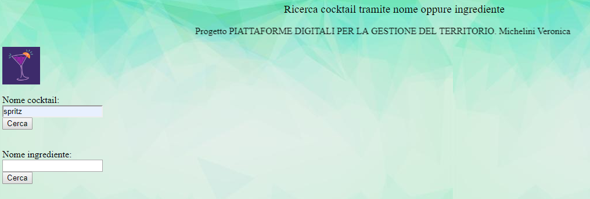

# drinkfinder
Veronica Michelini 286179
# Descrizione
Creazione di un web service in grado di ricercare una lista di drink dato un nome oppure un ingrediente.
Nella ricerca attraverso il nome verranno mostrati come risultato : il nome , l'immagine, la categoria, le caratteristiche, la ricetta, gli ingredienti e le dosi di questi.
Mentre la ricerca attraverso un ingrediente darà come risultato il nome del cocktail contenente quell'ingrediente e la sua imagine.
# Architettura
Il codice è scritto in php, e contiene anche delle piccole parti in HTML per la parte grafica. Le informazioni vengono acquisite da un API di database di cocktail. GitHub è stato collegato ad heroku, per gestire il webservice direttamente online.
All'interno della repository client si trovano i file : index.php , ListDrinkFound.php e ListIngredientFound.php.
All'interno della repository ws si trovano i file : GetData.php, GetDrink.php e GetIngredient.php.
## index.php
Il file è scritto interamente in HTML ed è la pagina iniziale dove poter inserire il nome del cocktail da cercare, oppure il nome dell'ingrediente. Nel primo caso verrà utilizzato il file ListDrinkFound.php e nel secondo caso il file ListIngredientFound.php.
Se il nome inserito è composto da due o più parole, attraverso la funzione urlencode la stringa inserita viene trasformata in URL, cioè viene inserito il simbolo '+' tra le parole.
## ListDrinkFound.php 
Il file è scritto in php; All'interno viene controllato se è stato inserito un nome nel campo apposito, per effettuare la ricerca tramite nome del drink; se il controllo va a buon fine il nome viene accodato all'url https://drinkfinder.herokuapp.com/ws/GetDrink.php?name= , il quale verrà usato come parametro per la funzione file_get_contents che restituirà tutti i drink con il nome indicato e le relative informazioni che mi interessa mostrare come risultato, in formato JSON.
I risultati vengono decodificati e convertiti in un array associativo, attraverso la funzione json_decode e infine stampati a video.
## ListIngredientFound.php
Il file è scritto in php; All'interno viene controllato se è stato inserito un nome nel campo apposito, per effettuare la ricerca tramite nome del drink; se il controllo va a buon fine il nome viene accodato all'url https://drinkfinder.herokuapp.com/ws/GetIngredient.php?name=, il quale verrà usato come parametro per la funzione file_get_contents che restituirà tutti i drink con il nome dell'ingrediente indicato e le relative informazioni che mi interessa mostrare come risultato, in formato JSON.
I risultati vengono decodificati e convertiti in un array associativo, attraverso la funzione json_decode e infine stampati a video.
## GetData.php
Il file è scritto in php e contiene due funzioni : 
- deliver_response : ha come parametri status (200, 204 oppure 400), status_message (rispettivamente a status : Presente, Assente, Errore richiesta non valida) e data (informazioni trovate). Restituesce l' array di risposta
- getData : Ha come parametro l'url che a seconda della ricerca sarà : https://www.thecocktaildb.com/api/json/v1/1/search.php?s= oppure https://www.thecocktaildb.com/api/json/v1/1/filter.php?i= , legge il file di risposta JSON del link , decodifica e converte il risultato in un array associativo e lo restituisce.
## GetDrink.php
Il file è scritto in php; Accoda all'url https://www.thecocktaildb.com/api/json/v1/1/search.php?s= il nome del drink che l'utente vuole cercare, lo passa alla funzione getData spiegata sopra e controlla il risultato:
- se la lista dei drink trovati è vuota, la funzione deliver_response viene richiamata con i parametri 204, assente e NULL.
- se nella lista dei drink trovati è presente almeno un cocktail, la funzione deliver_response viene richiamata con i parametri 200, presente e le info trovate.
- se invece il campo nome è stato lasciato vuoto, la funzione deliver_response viene richiamata con i parametri 400, errore e NULL
Contiene poi la funzione get_drinks che ha come parametro il risultato completo della ricerca dei cocktail e restituisce solo una parte di tutte le informazioni.
## GetIngredient.php
Il file è scritto in php; Accoda all'url https://www.thecocktaildb.com/api/json/v1/1/filter.php?i= il nome dell'ingrediente che l'utente vuole cercare, lo passa alla funzione getData e controlla il risultato:
- se la lista dei drink trovati è vuota, la funzione deliver_response viene richiamata con i parametri 204, assente e NULL.
- se nella lista dei drink trovati è presente almeno un cocktail, la funzione deliver_response viene richiamata con i parametri 200, presente e le info trovate.
- se invece il campo nome è stato lasciato vuoto, la funzione deliver_response viene richiamata con i parametri 400, errore e NULL
Contiene poi la funzione get_drinks che ha come parametro il risultato completo della ricerca dei cocktail e restituisce solo una parte di tutte le informazioni.
# Comunicazioni
/*Quando si inserisce il nome nel campo del cocktail o dell'ingrediente la richiesta alla API viene effettuata dalla funzioni getData che si trova all'interno del file getData.php, i rusultati vengono poi selezionati dalla funzione get_drinks che si trova all'interno del file getDrink.php e stampati da ListDrinkFound.php*/
# Documentazione API
GetDrink.php : URL -> https://drinkfinder.herokuapp.com/ws/GetDrink.php?name= , acquisisce attraverso il metodo GET il nome che l'utente vuole cercare.
GetIngredient : URL -> https://drinkfinder.herokuapp.com/ws/GetIngredient.php?name= , acquisisce attraverso il metodo GET l'ingrediente che l'utente vuole cercare.
Esempi:
### Caso primo: ricerca cocktail tramite nome (margarita)
URL : https://drinkfinder.herokuapp.com/ws/GetDrink.php?name=margarita.
Risultato:
{"status":200,"status_message":"Presente","data":{"drinkName":["Margarita","Blue Margarita","Tommy's Margarita","Whitecap Margarita","Strawberry Margarita"],"drinkImage":["https:\/\/www.thecocktaildb.com\/images\/media\/drink\/wpxpvu1439905379.jpg","https:\/\/www.thecocktaildb.com\/images\/media\/drink\/qtvvyq1439905913.jpg","https:\/\/www.thecocktaildb.com\/images\/media\/drink\/loezxn1504373874.jpg","https:\/\/www.thecocktaildb.com\/images\/media\/drink\/srpxxp1441209622.jpg","https:\/\/www.thecocktaildb.com\/images\/media\/drink\/tqyrpw1439905311.jpg"],"drinkCategory":["Ordinary Drink","Ordinary Drink","Ordinary Drink","Other\/Unknown","Ordinary Drink"],"drinkAlcoholic":["Alcoholic","Alcoholic","Alcoholic","Alcoholic","Alcoholic"],"drinkGlass":["Cocktail glass","Cocktail glass","Old-Fashioned glass","Margarita\/Coupette glass","Cocktail glass"],"drinkInstructions":["Rub the rim of the glass with the lime slice to make the salt stick to it. Take care to moisten only the outer rim and sprinkle the salt on it. The salt should present to the lips of the imbiber and never mix into the cocktail. Shake the other ingredients with ice, then carefully pour into the glass.","Rub rim of cocktail glass with lime juice. Dip rim in coarse salt. Shake tequila, blue curacao, and lime juice with ice, strain into the salt-rimmed glass, and serve.","Shake and strain into a chilled cocktail glass.","Place all ingredients in a blender and blend until smooth. This makes one drink.","Rub rim of cocktail glass with lemon juice and dip rim in salt. Shake schnapps, tequila, triple sec, lemon juice, and strawberries with ice, strain into the salt-rimmed glass, and serve."],"drinkIngredient1":["Tequila","Tequila","Tequila","Ice","Strawberry schnapps"],"drinkIngredient2":["Triple sec","Blue Curacao","Lime Juice","Tequila","Tequila"],"drinkIngredient3":["Lime juice","Lime juice","Agave syrup","Cream of coconut","Triple sec"],"drinkIngredient4":["Salt","Salt","null","Lime juice","Lemon juice"],"drinkMeasure1":["1 1\/2 oz ","1 1\/2 oz ","4.5 cl","1 cup ","1\/2 oz "],"drinkMeasure2":["1\/2 oz ","1 oz ","1.5 cl","2 oz ","1 oz "],"drinkMeasure3":["1 oz ","1 oz ","2 spoons","1\/4 cup ","1\/2 oz "],"drinkMeasure4":["null","Coarse ","null","3 tblsp fresh ","1 oz "]}}

### Caso secondo : ricerca cocktail tramite ingrediente (rum)
URL: https://drinkfinder.herokuapp.com/ws/GetIngredient.php?name=rum
Risultato:
{"status":200,"status_message":"Presente","data":{"ingredientName":["Adam Bomb","Adios Amigos Cocktail","Aztec Punch","Bahama Mama","Barracuda","Blue Hurricane","Espresso Rumtini","Hemingway Special","Jamaican Coffee","National Aquarium","Orange Whip","Radioactive Long Island Iced Tea","Rum Cooler","Rum Punch","Rum Toddy","Zippy's Revenge","Zombie"],"ingredientImage":["https:\/\/www.thecocktaildb.com\/images\/media\/drink\/tpxurs1454513016.jpg","https:\/\/www.thecocktaildb.com\/images\/media\/drink\/8nk2mp1504819893.jpg","https:\/\/www.thecocktaildb.com\/images\/media\/drink\/uqwuyp1454514591.jpg","https:\/\/www.thecocktaildb.com\/images\/media\/drink\/tyb4a41515793339.jpg","https:\/\/www.thecocktaildb.com\/images\/media\/drink\/jwmr1x1504372337.jpg","https:\/\/www.thecocktaildb.com\/images\/media\/drink\/nwx02s1515795822.jpg","https:\/\/www.thecocktaildb.com\/images\/media\/drink\/acvf171561574403.jpg","https:\/\/www.thecocktaildb.com\/images\/media\/drink\/jfcvps1504369888.jpg","https:\/\/www.thecocktaildb.com\/images\/media\/drink\/xqptps1441247257.jpg","https:\/\/www.thecocktaildb.com\/images\/media\/drink\/dlw0om1503565021.jpg","https:\/\/www.thecocktaildb.com\/images\/media\/drink\/ttyrxr1454514759.jpg","https:\/\/www.thecocktaildb.com\/images\/media\/drink\/rdvqmh1503563512.jpg","https:\/\/www.thecocktaildb.com\/images\/media\/drink\/2hgwsb1504888674.jpg","https:\/\/www.thecocktaildb.com\/images\/media\/drink\/wyrsxu1441554538.jpg","https:\/\/www.thecocktaildb.com\/images\/media\/drink\/athdk71504886286.jpg","https:\/\/www.thecocktaildb.com\/images\/media\/drink\/1sqm7n1485620312.jpg","https:\/\/www.thecocktaildb.com\/images\/media\/drink\/2en3jk1509557725.jpg"]}}

# Esempio ricerca cocktail attraverso il nome 

